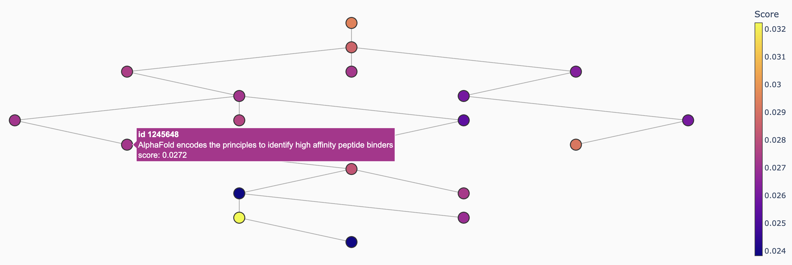

# SAECas

Citation cascade tracing using Sparse Autoencoders (SAEs).

## What is a cascade?

A **cascade** is a chain (or tree) of papers through a citation network that are maximally relevant to a query phrase. The intuition is that a research idea doesn't appear in isolation — it propagates forward through citations. Given an input phrase such as *"protein folding neural networks"*, SAECas finds the sequence of papers that collectively best represents that concept as it evolved through the literature, following the citation graph from earlier foundational work to later applications.


*A sample info cascade in a citation network showing the concept spread of protein folding neural networks*

## Algorithm

### 1. Query embedding and feature extraction

The input phrase is embedded with [SPECTER2](https://huggingface.co/allenai/specter2_base) (a transformer trained on citation-aware scientific text) to produce a 768-dimensional dense vector. This vector is passed through the encoder of a pre-trained TopK Sparse Autoencoder, which projects it into a 2048-dimensional sparse feature space with at most *k* = 64 active features.

### 2. IDF-weighted feature scoring

Each active feature *f* receives a weight:

$$w_f = \text{act}_f \cdot \log\left(\frac{N}{\text{df}_f}\right)$$

where *N* is the corpus size and $df_f$ is the number of papers for which feature *f* is active ($\text{act}_f$). This suppresses features that fire on most papers (capturing generic structure rather than concept-specific content), leaving a sharper, more discriminative signal. Weights are L1-normalized to sum to 1.

### 3. Node scoring

Each paper *v* in the corpus receives a score:

$$s(v) = \sum_f w_f \cdot a_{v,f}$$

where $a_v$ is the paper's pre-computed SAE activation vector. Because both the query weights and paper activations are sparse, this is a sparse dot product over at most *k* features — O(*kN*) across all papers. Papers below the 95th percentile score are zeroed out, leaving roughly the top 5% as candidates.

### 4. Heaviest path or tree

**Path mode.** The citation graph contains mutual-citation cycles, so a topological sort is not directly applicable. SAECas first computes the SCC condensation of the candidate subgraph — collapsing each strongly connected component into a single super-node — yielding a DAG. Dynamic programming on the condensation then finds the heaviest-weight path in O(V + E) time. The best member of each super-node on the winning path is selected to form the final chain.

**Tree mode.** Starting from the highest-scored paper, a greedy arborescence is grown by repeatedly attaching the unvisited neighbor (in either citation direction) with the highest score, up to a configurable node limit. This runs in O(V · k) where k is the max tree size.

## Setup

```bash
# Install dependencies
pip install torch transformers networkx pandas numpy dash plotly tqdm

# Pre-compute SAE activations (needed once)
python embed_sae.py

# CLI
python saecas.py "CRISPR gene editing"
python saecas.py "protein folding" --tree --max-tree-nodes 25

# Interactive visualizer
python app.py   # → http://localhost:8050
```

## Files

| File | Purpose |
| --- | --- |
| `embed_sae.py` | One-time script: passes SPECTER2 embeddings through the SAE and saves activations |
| `saecas.py` | Core algorithm: query → feature weights → node scores → heaviest path/tree |
| `app.py` | Dash visualizer with path/tree toggle and score percentile controls |
| `saes/` | SAE model definition, training code, and data |